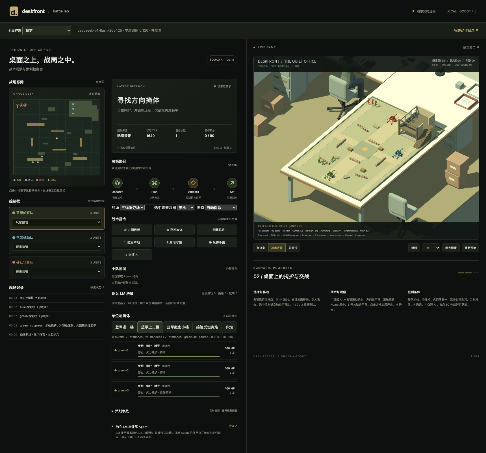

# Deskfront AI Sandbox · 桌面战术沙盒

**让 AI 创造关卡、指挥游戏、解释战局的开源 Godot + Blender 项目。** 连接一个 LLM，它可以设计具有战术取舍的桌面对抗关卡、部署三方玩具兵，在对局中接管士兵与坦克，并依据真实战斗记录输出态势和战后分析。玩家保留 RTS 操作与随时接管的权利。

当前实现以中央夺旗为可玩的基础环境：不是只展示 AI 建议，而是让数据化关卡进入 Godot，经过同一套导航、掩体、武器、生存和胜负规则执行。

[创作—对抗—复盘使用指南](docs/studio/README.md) · [开放 API](docs/studio/API.md) · [关卡 JSON Schema](data/studio-scenario.schema.json)

[完整文档目录](docs/README.md) · [动作接口](docs/AGENT_ACTION_STATES.md) · [贡献指南](CONTRIBUTING.md) · [更新日志](CHANGELOG.md)

当前发布标记 **v9.19**（2026-09-19）；游戏运行时版本 **0.6.5-flag.1**。历史标签保持不变。当前工作版新增中央夺旗：独占旗圈守满 30 秒获胜，争夺暂停，弃旗清零；红方坦克预停上方桌面并缓慢驶入。详见 [夺旗模式](docs/FLAG_MODE.md)。



## 从一个意图开始

打开策划台 **AI 创作沙盒** → 描述想体验的战术 → LLM 生成并通过 Godot 校验 → 查看布阵 → 选择玩家和对手控制 → 进入关卡、继续开局 → 分析态势或阅读自动战后报告。

不配置模型也能导入 [示例关卡](data/studio-example.json) 并用游戏 AI 试玩。默认 LLM 使用现有火山方舟 DeepSeek 配置；Key 只留在服务端。所有模型角色的真实输入和返回可在“LLM 调用日志”核对。

## 双人桌面演示

顶部新增 **演示导演**：描述意图 → 模型设计并验证关卡 → 逐项放置 → 双方从桌边派兵 → 夺旗 → 复盘并生成下一关。也可选择明确标注的本地示例排练；提供窗口录制和事件时间线导出。

[演示使用指南](docs/demo/README.md) · [导演接口](docs/demo/API.md) · [验收与当前限制](docs/demo/DELIVERY.md) · [策划、执行、独立游戏视图](docs/VIEWS.md)

## 无尽东线

顶部 **无尽东线 →**：绿色远征队由玩家、游戏 AI、JEV 或 DeepSeek 指挥，从左向右推进；接近前沿时构筑下一段防线，夺点、补给并继续向东。在场世界采用有限窗口回收。可选本地种子生成或模型选择防线，失败后备与实际来源可见。

新增可选 **DeepSeek 多题并行 + logprobs** 战斗适配器，实际概率与输入输出进入日志，不把 token 概率称为战术胜率。当前东线为步兵与可破坏沙包模板，可逐步扩展战壕和装备组件。

[玩法与启动](docs/eastfront/README.md) · [编辑器 / Agent API](docs/eastfront/API.md) · [DeepSeek 优化说明](docs/eastfront/DEEPSEEK.md) · [本轮交付](docs/eastfront/DELIVERY.md)

## 游戏能力

- 三个阵营、九名步兵，三张 JSON 驱动地图；一次红方坦克增援。
- 步枪、冲锋枪、火箭筒、手枪、手雷和刺刀；首碰撞弹道、压制、方向掩体及破坏。
- 先寻找保护，再掩护推进；跑动、低姿移动、匍匐、探头、换弹与撤退。
- 反坦克炮接管、推行、部署、开炮和弃炮；轻武器不会攻击坦克。
- 蓝军沿楼梯进入两层小楼、守窗和撤离；楼板失效会坍塌。
- 本地策划台展示真实状态、参数、控制权、逐单位 LLM 决策和引擎回执；[LLM 调用日志](docs/LLM_CALL_LOG.md)可查看完整输入、原始返回并导出 JSON。
- 左下角常驻 LLM 输入 / 输出；勾选 **Debug Visualize** 查看真实路点、已走轨迹、当前指令和执行约束。[使用与接口](docs/DEBUG_VISUALIZE.md)。

Godot 是唯一战斗状态来源。Blender 原稿、骨骼、动画、素材来源和许可随源码提供。

## 快速开始

从源码运行需要 **Python 3.9+、Godot 4.5.1 和对应版本 Web 导出模板**。浏览器需要 WebGL2。编辑美术才需要 Blender；已验证资源工具版本为 Blender 5.2.1 LTS。Node.js 仅用于可选浏览器测试。

```sh
git clone https://github.com/fangligamedev/deskfront-jevlab.git
cd deskfront-jevlab
# 历史稳定版可执行 git checkout v9.19；AI 沙盒与 JEV 接入使用 main
python3 tools/project.py import
python3 tools/project.py web
python3 tools/run.py
```

打开 **http://127.0.0.1:8768/**，点击游戏画面启用音频。终端保持运行，Ctrl+C 停止。macOS 也可双击根目录的启动桌面前线.command。找不到引擎时，将 GODOT_BIN 设置为可执行文件路径，或把 godot 加入 PATH。

源码仓库不包含 build/。已有 Web 交付包时只需 Python 和浏览器，运行同样的启动命令；run.py 不自动重建已有导出，修改游戏后需要重新导出。

### 原生运行

Godot 打开 project.godot，按 **F5**。另运行 `python3 tools/server.py`，控制台打开 **http://127.0.0.1:8768/?native=1**。同一端口只连接一个游戏实例，避免网页游戏和原生窗口争用状态。多实例和平台设置见 [开发指南](docs/DEVELOPMENT.md)。

### TypeSafe JEV 战斗版本

已接入 JEV 原生结构化决策 API，9 名士兵和坦克逐单位选择战术。服务端设置 `DESKFRONT_LM_PROVIDER=typesafe_jev`、`TYPESAFE_API_KEY` 和 `TYPESAFE_MODEL=jev-1.13.0` 后重启服务；界面自动显示 TypeSafe JEV。战斗状态、原始回答、概率及执行回执均可在模型日志中查看。详见 [JEV 使用与验收](docs/JEV_CONTROL.md)。

JEV 用于战术选择；自然语言关卡创作和叙述式战报保留独立的 DeepSeek 文本模型配置。

### 可选 LLM

不配 Key 时可手动选择「游戏 AI」完整游玩。复制 .env.example 为 .env，设置自己的 ARK_API_KEY 和已开通的 DESKFRONT_LM_MODEL，重启服务，主游戏新局默认三方 LLM 驱动；也可点击顶部「开始 DeepSeek LLM 对战」。按钮会让三个阵营的步兵和坦克由模型独立决策，并恢复战斗；对局已结束时会先重开。单纯切换控制下拉框仍尊重暂停状态。

步兵与坦克独立决策；默认每局最多 600 次请求、并发 3。真实调用产生供应商费用，重开会重置本局预算。Key 仅在本地服务端读取，不提交 .env。[完整 LLM 配置](docs/LM_CONTROL.md)。

## 操作

新增单兵射击模式：选中步兵后按 **F6** 或点击「第三人称接管 / 第一人称接管」。**WASD** 移动、**Shift** 冲锋、鼠标瞄准、左键射击、**E** 掩体、右键探身、**V** 切换视角、**Tab** 返回 RTS。详见 [单兵接管说明](docs/SHOOTER_MODE.md)。

| 操作 | 输入 |
| --- | --- |
| 接管阵营 | 1 / 2 / 3 |
| 单选 / 框选 / 追加 | 左键士兵 / 左键拖动 / Shift |
| 移动 / 攻击 | 右键地面 / 右键敌人 |
| 镜头 | 中键或 Alt + 左键拖动；方向键平移；滚轮缩放；Home 居中 |
| 掩体 / 守住 / 撤退 | C / H / R |
| 交回游戏 AI | A |
| 手雷 / 手枪 / 切地图 | G / P / F2 |
| 视角 / 静音 / 暂停 | V / M / 空格 |
| 坦克增援 / 隐藏 HUD | T / F1 |

全局或按阵营切换「游戏 AI / DeepSeek LLM / 外部 Agent / 玩家」。控制台可调整姿态、装备、上楼、撤楼、接管炮和弃炮。设施按钮会接管对应阵营；交回 AI 后继续自主作战。独占旗圈达到守旗时长获胜；自定义关卡可设为 20–90 秒，默认 30 秒。

## 工程结构

| 目录 | 内容 |
| --- | --- |
| assets/ | 实际加载的模型、声音、字体、特效 |
| source/ | Blender 原稿、第三方原始资源和重建脚本 |
| scenes/ / scripts/ | Godot 场景、战斗、战术、设施、角色与同步 |
| data/ | 规则、地图、步态和机器可读动作目录 |
| dashboard/ | 本地策划网页 |
| tools/ / tests/ | 服务、Agent、LLM、构建、检查和行为测试 |
| docs/ | 设计、工程、资源、API、研究、交付和证据 |
| .github/ | CI、Issue 和 PR 模板 |
| build/ / output/ / dist/ | 本机导出、日志和交付包，不入 Git |

source/latest/ 是当前资源；source/blender/ 保留历史原稿。不要用旧生成器覆盖当前运行模型。

## 开发与验证

```sh
# 无引擎、无 API Key 的基础检查
python3 tools/check_project.py
python3 -m unittest discover -s tests -p 'test_*.py' -v

# 真实 Godot 行为检查
python3 tools/project.py import
python3 tools/project.py test

# 可选：先导出 Web 并运行服务，再在另一个终端执行
npm ci
npx playwright install chromium
npm run test:browser
```

CI 运行项目合同检查、离线 Python 测试及真实 Godot 导入/测试，不自动调用收费 LLM。完整演练、构建和排错见 [开发指南](docs/DEVELOPMENT.md)。

0.6 已有验证：100/100 场战术演练、25 项 RTS Web、6 项设施 Web、11 项真实 LLM 接入检查。它们是对应构建的证据，不代表每台机器的性能或模型胜率。[验证记录](docs/evidence/v06/verification.json)。

## 说明文档

[完整目录](docs/README.md) 列出全部已发布 Markdown 文档，区分当前指南和历史报告。

| 文档 | 内容 |
| --- | --- |
| [设计](docs/DESIGN.md) | 场景、目标、战斗、模式与边界 |
| [工程](docs/ENGINEERING.md) | 模块、数据流、状态权威和执行 |
| [开发](docs/DEVELOPMENT.md) | 安装、运行、测试、导出和排错 |
| [资源配置](docs/ASSETS.md) / [设施](docs/ASSET_EQUIPMENT.md) | 原稿、尺度、规则、火炮和小楼 |
| [Agent API](docs/AGENT_API.md) / [动作状态全集](docs/AGENT_ACTION_STATES.md) | HTTP 协议、权限、人物/坦克/武器动作 |
| [LLM 接入](docs/LM_CONTROL.md) | 配置、调度、预算与失败处理 |
| [战术](docs/TACTICS.md) / [研究](docs/REFERENCES.md) | GDC 参考与实现映射 |
| [交付报告](docs/DELIVERY.md) | 当前整理发布与玩法验证 |
| [发布流程](docs/RELEASING.md) | 版本、提交、标签与验收 |

## 参与和许可

通过 [Issues](https://github.com/fangligamedev/deskfront-jevlab/issues) 或 PR 参与；先阅读 [贡献指南](CONTRIBUTING.md)。安全问题见 [SECURITY.md](SECURITY.md)。

代码和文档采用 [MIT](LICENSE)。模型/动画主要 CC0；部分 Q009 衍生声音 **CC-BY-SA 3.0**，字体 **OFL 1.1**。代码许可不替代素材的独立许可，详见 [资源许可](assets/LICENSE.md) 和 [第三方来源](THIRD_PARTY.md)。

当前是三地图战术原型，没有联网对战、战争迷雾或成熟的多智能体通信。炮组为单人操作，后备炮弹不限量。Jev 保留通用 Agent 接口，未连接专属 SDK。macOS 导出未签名、未公证。没有使用《英雄连》的代码或资产。
