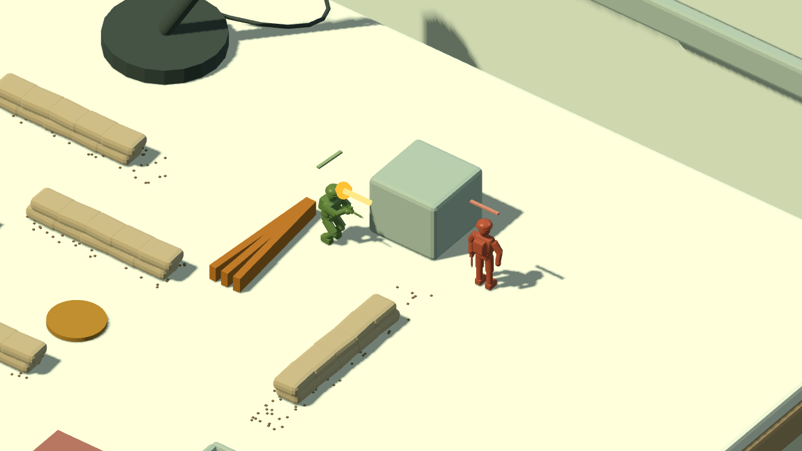
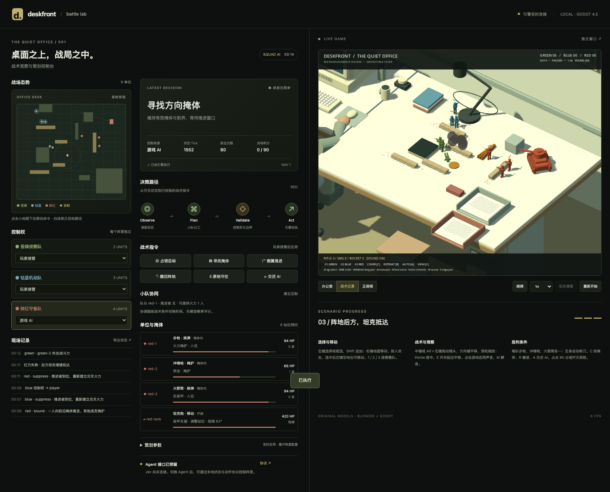

# 桌面前线 0.3.0 · 战术行为交付报告

交付日期：2026-09-18。本轮重点改进士兵协同、掩体CQB与坦克战斗行为。沿用现有Godot＋Blender工程、RTS操作、弹道与声音。此前报告见[0.2.0](DELIVERY-v0.2.0.md)。

## 已完成

- **协同推进**：步枪掩护、冲锋枪突击、火箭筒反装甲。先占掩体建立火力，再由一人推进；有射界且能开火的队友才能计为支援。队友换弹或被压制导致支援中断时，停止绕侧并寻找保护。
- **掩体CQB**：硬障碍后隐蔽、真实移动到角落开火、换弹/受压制时回缩。敌方受压制或严重受伤才允许AI绕掩体端部；目的地必须可达且绕过方向保护。刺刀不能穿过沙包或高障碍。
- **柔性队形**：共享虚拟锚点、预测位置、楔形/纵列、速度修正、目标迟滞、到达分散与预约。行军接敌立即取消队形推进，避免覆盖战斗站位。队长死亡不交换其他成员的兵种角色。
- **坦克**：按射程、射界与火箭筒威胁选位；近距离反坦克威胁或低血量时倒车。Blender模型保留独立炮塔与炮口，行驶时炮塔仍可跟踪，瞄准后才开炮。前/侧/后装甲采用不同承伤倍率。
- **导航修复**：重建时清除旧阻挡格，已炸毁沙包真正可通行；薄障碍采用精确线段判定。避免微小目标变化反复寻路。正俯视镜头固定画面方向，修复平滑平移时轴向旋转导致位移抵消。
- **策划台与Agent状态**：显示阶段、队长、推进者、支援成员数、单兵角色/姿态、坦克炮塔方向。移除固定候选百分比，明确显示规则协调器；非法攻击目标不会取消已有计划。Jev尚未接入。

## 参考如何使用

已完整阅读用户提供的Jurney队形PDF，并核对插图。新增GDC视频已访问公开播放流，抽查关键演示与幻灯片，涵盖小队协同、方向偏好、共享知识与小队寻路；未取得字幕或完整听译。逐页/时间段映射、原创实现与未覆盖内容见[TACTICS.md](TACTICS.md)和[REFERENCES.md](REFERENCES.md)。未复制原游戏代码、素材、PDF或视频到开源包。

## 试玩

刷新 <http://127.0.0.1:8768>，点游戏区域启用输入和声音。先保持游戏AI观察掩护推进；按V切近景，1/2/3接管整队，右键地面移动，C找掩体，A交回AI。中键拖动相机，滚轮缩放，M控制声音。完整操作见[README](../README.md)。

macOS包：`dist/Deskfront-macos-0.3.0.zip`。解压运行应用；原生配套控制台使用 <http://127.0.0.1:8768/?native=1>。一个端口只连接一个游戏实例。macOS开发构建未签名/未公证，已验证解压后的实际启动。

可复现场景：Godot打开`tests/tactics_visual.tscn`，观察同一士兵隐蔽、探头射击和换弹回缩，6秒后输出截图并退出。它是受控验收场景，不冒充正常战局抓拍。

## 验证

- **112项Godot玩法检查通过**，包含原81项回归与31项新增检查。
- **6项Python协议测试、25项真实浏览器检查通过**。覆盖镜头/框选/地面操作、队形、协同状态、Agent权限与回执、非法指令保留计划、重开和真实非零WebAudio输出；浏览器控制台无错误。
- **3组固定种子自动实战通过**：209、206、185次真实发射；存活步兵掩体采样占比约71.2%、72.3%、76.1%；5、5、6次掩护推进；导航采样无进入阻挡格。每场约48–53秒结束，路径查询794–1040次，无头模拟约0.5–0.7秒完成，此耗时不代表渲染帧率。
- 受控CQB场景验证一次只派一人绕侧，支援中断就撤回；默认三组战局未自然触发绕侧，不夸大为每局必有包抄。
- **16项资源来源与严格许可检查通过**；坦克GLB/Godot导入审计通过。Web与macOS均经过严格导入、语义、运行和真实导出检查。
- macOS发布包实际交战、有坦克与音效时本机M4 Max最终快照采样243 FPS（此前一次采样113 FPS，均为单机瞬时值，并非性能基准）；无头浏览器较慢，本轮采样5–7 FPS，详细数值见browser-report.json，不据功能通过宣称性能优化完成。

证据位于[docs/evidence/v03](evidence/v03/)，包括玩法结果、自动战局、三帧CQB、浏览器报告、原生截图/状态、资源审计和发布清单。ZIP校验和在`dist/SHA256SUMS.txt`。

## 交付范围

Godot源码、可编辑Blender坦克源文件、配置、测试、设计/工程/资源/API文档均已更新。代码与文档MIT，原创资产CC0。工程版本0.3.0；此前`V0.1`标签保留在原提交`60b33a6`，不改写历史标签。

本轮仍是三人小队、完全信息、简化桌面导航；没有完整入室破门系统、写实贴墙动画、战争迷雾或大型多编队调度。三组默认战局均为获得坦克的红方获胜，阵营平衡仍需后续调优。坦克模拟包括距离、朝向、炮塔和装甲倍率，未实现弹跳/穿深/履带损坏。具体配置及限制已写入战术文档。

- `dist/Deskfront-source-0.3.0.zip`：完整可重建源码、Blender源、配置、文档与测试。
- `dist/Deskfront-playable-web-0.3.0.zip`：Web游戏与本地策划控制台。
- `dist/Deskfront-macos-0.3.0.zip`：macOS应用与许可。
