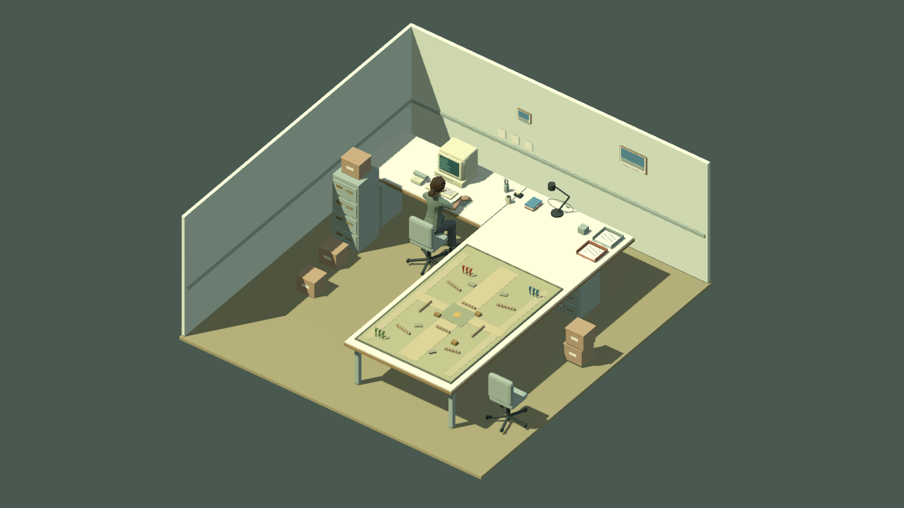
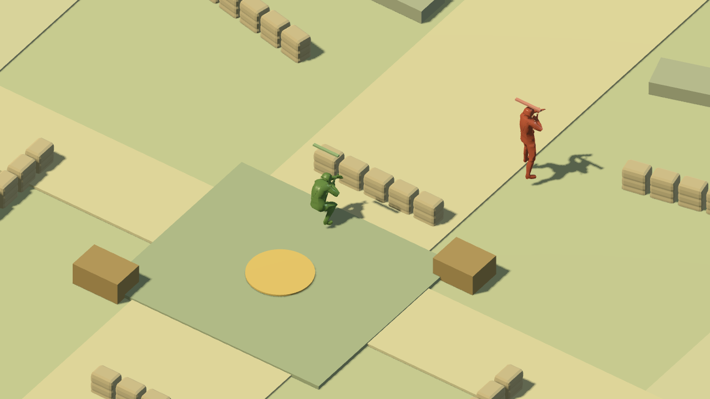
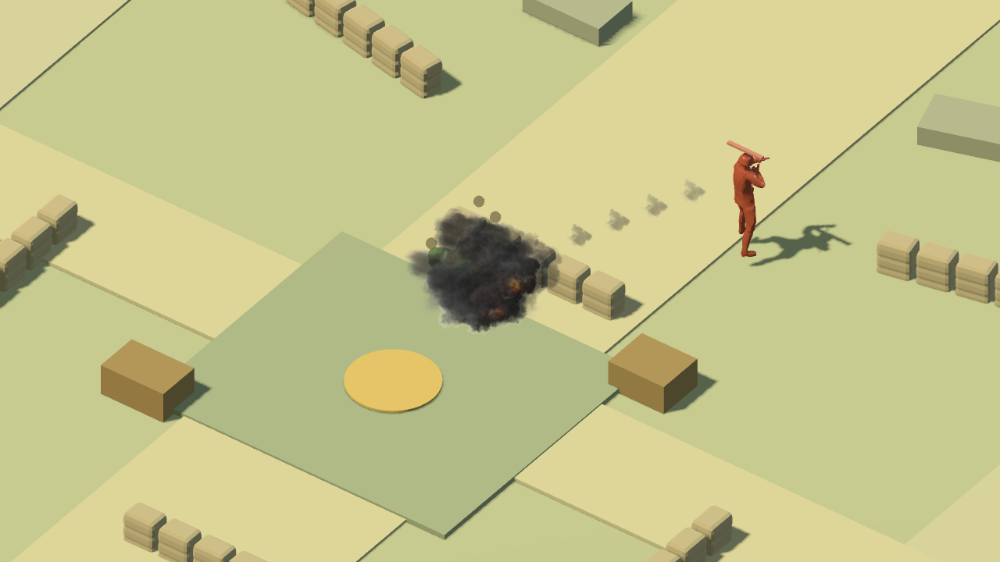

# 桌面前线 0.4.0 · 最新资源集成交付报告

2026-09-18。将两个「玩具兵（资产）」任务的最新资源，接入正式 Godot 游戏及策划控制台。原有三阵营 AI、玩家接管、协同掩护、RTS 镜头和 Agent 状态接口继续使用。

## 已集成

- **士兵**：50 骨骼、22 动作资源，三阵营纯色材质。步行由根运动驱动游戏坐标；蹲姿横移为有限步幅，支撑脚双骨 IK，完成一步后才能变向或换姿态。
- **武器与坦克**：新版步枪、手枪、火箭筒、手雷模型；T2 坦克归一化至 0.30 m，保留履带动画并接入独立炮塔和炮口。手枪可在控制台换装；每兵 2 枚手雷，动作开始 0.62 秒后才生成弹体。
- **战斗效果**：新版图集/流向混合的半透明尾烟与爆炸，Q009 分武器声音，18 刚体驱动原蒙皮的死亡效果。命中仍由原有弹道统一结算，无第二套演示伤害。
- **场景**：扩建办公室、加长桌面、62 骨骼办公人物缓慢打字；三线争夺场、河谷双桥、前哨阵地接入真实出生点、目标、方向掩体、导航与毁坏逻辑。环境光参数保留。
- **控制台**：地图选择、装备选择、投雷按钮和新状态字段。F2 换图，G 投雷，P 切手枪，原有 V/滚轮/中键镜头操作继续使用。

## 玩的方法

启动根目录 `启动桌面前线.command`，或运行 `python3 tools/run.py`，打开 http://127.0.0.1:8768。已有页面请刷新。点击游戏区域启用输入和声音，按 V 拉近，1/2/3 接管阵营，中键拖动镜头、右键下令。按 G 向射程内最近敌人投雷。换地图会重开该局并使旧 Agent run_id 失效。

地图、单位和武器参数分别位于 `data/sandbox-maps.json`、`data/battle.json`；步态接触表位于 `data/gait.json`。可编辑 .blend、原始模型和动画库位于 `source/latest`。资源登记命令已修正，不会再被旧版生成文件覆盖。

## 验证与证据

- 112 项原有 Godot 战斗/权限/镜头检查通过，旧坐标战术场景保留为明确的测试夹具，使用新版兵模与效果。
- 89 项新版集成检查通过：三地图出生与目标可达、桥面通行/河面阻挡、T2 炮口朝向、根运动、33 mm 有限侧步、支撑脚滑移小于 0.5 mm、手雷释放与消耗、布娃娃和物理掩体毁坏。
- 6 项 Python 控制协议测试通过；真实 Web 输入 25 项检查通过，包含非零 WebAudio PCM。最终导出的地图/装备/投雷专项 12 项也通过。
- 3 图自动战斗采样通过：三线争夺场 80 次发射、河谷双桥 62 次、前哨阵地 177 次；掩体采样占比约 53.2%、20.2%、27.4%，未发现进入禁行格。采样最长 90 秒，不据此声称阵营已平衡。
- 9 个当前模型全部完成原始 GLB 与 Godot 导入审计；33 项已登记资源的哈希和严格许可检查通过。
- 原生受控特写实际检查蹲姿、侧步、烟火和布娃娃；截图是游戏渲染，不是重新生成的概念图。
- macOS 发布包已解压实际启动，0.4.0 状态、三线争夺场、T2 炮弹与声音均确认；本机 M4 Max 单次采样 114 FPS，不作为性能基准。
- 无头浏览器采样常规操作约 5–6 FPS（密集交火截图约 3 FPS），仅用于功能验收；不宣称本轮完成性能优化。

证据保存在 `docs/evidence/v04/`；可复现命令见 README 和工具脚本。

## 许可与实现边界

代码 MIT，主要模型/动作/图集 CC0；新增 Q009 音效及其衍生 WAV 为 **CC-BY-SA 3.0**，字体为 OFL 1.1。作者、链接、改编说明和许可正文随源工程及游戏包保留。见 THIRD_PARTY.md，不能将全部资产统一标记为 MIT。

横移防滑验收覆盖平面桌面和固定朝向的有限侧步，不表示所有动画都完成精细接触优化。冲锋枪暂共用步枪模型；翻滚/闪避等动作已导入，但未新增对应玩家技能。刺刀保留原有近战逻辑，未声称新增精细刺刀骨骼动作。布娃娃复制死亡时的静态碰撞，不持续同步之后的掩体变化。旋转掩体寻路使用保守包围盒，河中原预览目标移动到可占领的南岸。

工程版本 0.4.0；保留原 V0.1 标签不变。macOS 开发构建未签名、未公证。Jev 继续通过通用 Agent 接口接入，本轮没有新增专有模型凭据或伪造连接状态。

## 交付文件

- `dist/Deskfront-source-0.4.0.zip`：源码、Blender 来源、配置、许可与文档。
- `dist/Deskfront-playable-web-0.4.0.zip`：Web 游戏与本地策划台。
- `dist/Deskfront-macos-0.4.0.zip`：macOS 应用与许可。
- `dist/SHA256SUMS.txt`：ZIP 文件校验和。
