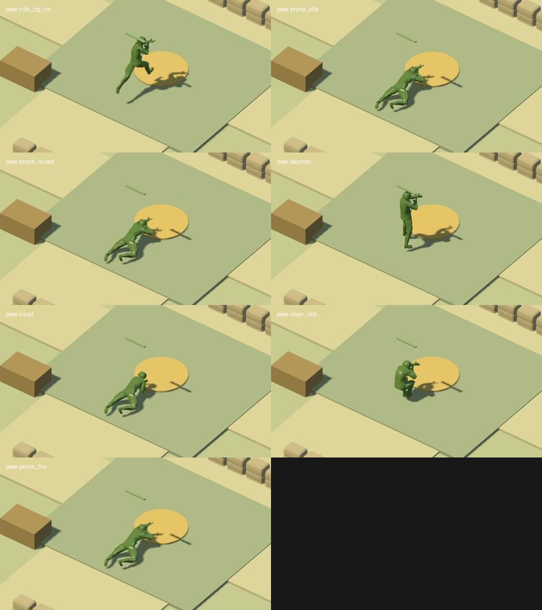
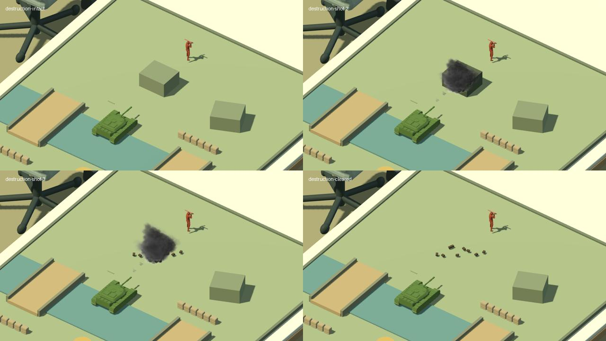

# 桌面前线 0.5.0 · 战术执行迭代交付报告

交付日期：2026-09-19。Godot 4.5.1 / Blender 5.2.1。版本基线是 0.4.0（87f718b）；原 **V0.1 标签保持不变**。

## 本轮交付

1. 修复“趴下实际蹲着、移动统一慢走”。士兵现按姿态使用跑、低姿移动、爬行、趴射和趴姿装填。低沙包后隐蔽会真实趴低，高墙后保持蹲姿；命中盒跟随姿态。补齐 6 个片段，当前共 50 骨 / 28 动作，保留 Blender 源文件和重建脚本。
2. 选掩体先拒绝错误保护侧，再考虑收益；检查导航格点取整后的真实落点、到达误差和空间预约。危险时优先隐藏或撤离；推进需要另一人近期真正开火并仍能提供掩护。
3. 修复避让造成的墙角切线和原地空跑：精确检查通路格点，重新绕过占路单位，无安全路线则停止并公开原因。坦克先转车身再行驶，按前进/倒车/左右转使用对应履带片段，炮塔独立瞄准。
4. 所有飞行弹丸执行逐段几何射线检测，最近物体先承受命中；不再仅对预先选中的敌人概率扣血。爆炸先判断遮挡，再破坏掩体。沙包、箱、墙、岩石/建筑有耐久和受损外观，摧毁后出现残骸并同步移除碰撞、预约和导航阻挡。
5. 新增策划姿态选择器，开放 Agent `posture` 指令、可执行动作清单及四层状态。手雷校验库存、距离、压制和忙碌状态，提供真实拒绝回执。

**Agent 文档：**[角色、坦克、武器全部动作与状态系列](AGENT_ACTION_STATES.md)。机器目录为 `data/action-catalog.json` / `GET /api/action-catalog`。通用接口有所有权与状态新鲜度校验；没有伪造 Safetype.ai/Jev 专属连接。

## 100 场最终验收

10 类情境各 10 场、100 个固定种子，地图分布 34 / 33 / 33。每场上限 60 秒，提前分出胜负则结束，累计实际模拟 **5843.6 秒**。全部运行真实 Godot AI、路径、根运动和弹丸执行器，未另写简化战斗模拟。

| 情境 | 通过 | 射击数 | 失效保护位最长停留 | 有移动任务但不前进最长时间 |
|---|---:|---:|---:|---:|
| 遭遇战 | 10/10 | 883 | 0.5 s | 0.5 s |
| 受压制 | 10/10 | 705 | 0.5 s | 0.5 s |
| 被绕后 | 10/10 | 716 | 0.5 s | 1.0 s |
| 掩体被毁 | 10/10 | 826 | 0.5 s | 0.5 s |
| 重伤 | 10/10 | 850 | 0.5 s | 1.0 s |
| 墙角交火 | 10/10 | 835 | 0.5 s | 0.5 s |
| 反坦克威胁 | 10/10 | 890 | 1.5 s | 1.0 s |
| 手雷 | 10/10 | 761 | 0.5 s | 0.5 s |
| 交叉火力 | 10/10 | 860 | 0.5 s | 1.0 s |
| 撤退 | 10/10 | 407 | 0.5 s | 0.5 s |

最终记录 **7733 次射击**、**323 次掩体摧毁**（包含“掩体被毁”情境注入，并非全部由炮火造成）。越界导航、趴姿误播蹲姿、战斗移动误用 walk 的记录均为 0。门槛为无错误导航/动画，失效站位连续停留 ≤1.5 秒、原地移动 ≤4 秒；实际最大值分别为 **1.5 秒 / 1.0 秒**。

这是针对明确行为约束的回归验收，不证明全局最优 AI、商业游戏品质或所有地图均无问题。无头固定步长也不等同于变帧率实机逐帧重放。

[统计与逐场种子](evidence/v05/rehearsal-summary.json) · [完整状态采样（gzip JSON）](evidence/v05/rehearsal-full.json.gz) · [运行代码/数据哈希](evidence/v05/runtime-source-hashes.json)

## 失败如何推动了修复

先导演练发现侧步结束的短暂错动画。最初仅检查越界/动画/慢走时，100 场能通过；增加持续时间门槛后，发现部分士兵在墙角或队友旁空跑。修复过程中保留了失败，未降低门槛：安全跳点替代任意跳点、格点交叉检测替代稀疏采样、重新定位路径、临时占位绕行和失败回退逐步消除问题。格点取整后的错误保护侧也加入硬性拒绝。

[迭代历史](evidence/v05/iteration-history.json)保留早期失败轮次与种子。参数遵循“先保证可达与生存，再安排掩护推进”，没有通过无敌、回血、瞬移或取消伤害来提高通过率。

## 其他验证

- 113 项原有语义检查、89 项资源/地图接入检查、31 项新增战斗合同检查、7 项 Python 接口测试通过。
- 新增合同覆盖六类弹丸首碰墙面、遮挡爆炸、低姿射线、穿过摧毁缺口、截获弹丸的中间单位、友军挡弹、实际趴姿高度和爬行位移、低掩体隐蔽、Agent 姿态权限、坦克先转向再移动。
- 士兵/办公人物骨骼轨道、循环与根轨迹审计通过。实机测得站/蹲/趴头部高度约 0.12 / 0.070 / 0.031 m。
- Web 与 macOS 严格资源权利检查、导入、运行和真实导出通过。macOS 导出包已解压运行，连接到控制服务并产生炮弹/音频事件；本机 M4 Max 短时末次采样 112 FPS，不能当作性能基准。
- 最终 Web 导出通过 25 项鼠标/键盘/声音/接口回归、6 项新姿态与 Agent 操作检查、12 项资源与地图检查。软件渲染的无头浏览器很慢，不将它宣称为可玩性能测评。
- 源码 ZIP 在全新临时目录重新导入并通过全部 Godot/Python 检查；修复了旧资源测试缺少输出目录时挂起的问题。Web ZIP 解压后，本地服务、游戏入口与动作目录均能加载。
- 资源测试采用可控射程和暂停快照来验证手雷释放；实战中状态变化导致的 `grenade_unavailable` 仍保留，未放宽压制和装填限制。

[浏览器操作](evidence/v05/browser-regression.json) · [姿态与 Agent](evidence/v05/web-tactics.json) · [资源回归](evidence/v05/web-assets.json) · [干净源码重建日志](evidence/v05/clean-source-test.log)

[新增战斗合同](evidence/v05/combat-contract.json) · [原生导出运行](evidence/v05/native-export.json) · [测试日志](evidence/v05/tests.log)

## 交付物与运行

- `dist/Deskfront-source-0.5.0.zip`：源码、Blender 来源、数据、许可、文档。
- `dist/Deskfront-playable-web-0.5.0.zip`：Web 导出与本地策划服务，包含机器动作目录。
- `dist/Deskfront-macos-0.5.0.zip`：macOS 开发构建，未签名、未公证。
- `dist/SHA256SUMS.txt`：包校验值。

双击 `启动桌面前线.command`，或 `python3 tools/run.py`，打开 `http://127.0.0.1:8768`。已有页面刷新后确认 `/api/state` 的 `state.version` 为 `0.5.0`。1/2/3 接管阵营，左键/框选，右键地面移动，C 找掩体，R 撤退，A 交回 AI；策划页可指定趴姿，移动即爬行，自动姿态会按环境恢复。

## 明确边界

破坏按整块地图物件执行，尚无任意网格断裂、建筑内部破门清房或坦克模块损坏。运行命中体是有向盒代理，未做逐三角网格命中。当前持枪/装填仍有通用动作复用，转身与全部移动方向尚未做全套脚接触质量认证；不能称为《英雄连》同等品质。状态仍为完全信息，无战争迷雾；Jev 专属 SDK 尚未接入。

参考资料的实际阅读范围与采用原则见 [TACTICS.md](TACTICS.md)：完整重读四页队形章节，核对 GDC 官方摘要及已有关键帧，并补充阅读位置选择架构开篇；没有声称完整听译视频。
