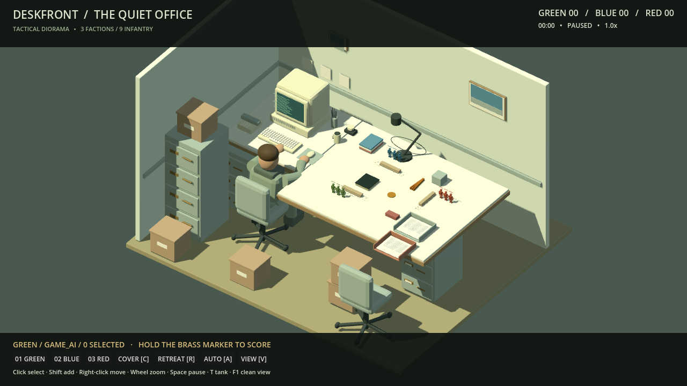
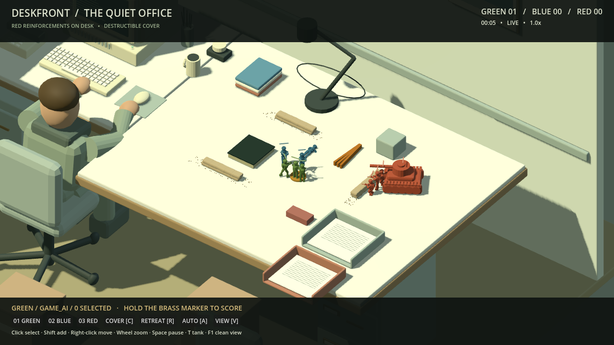
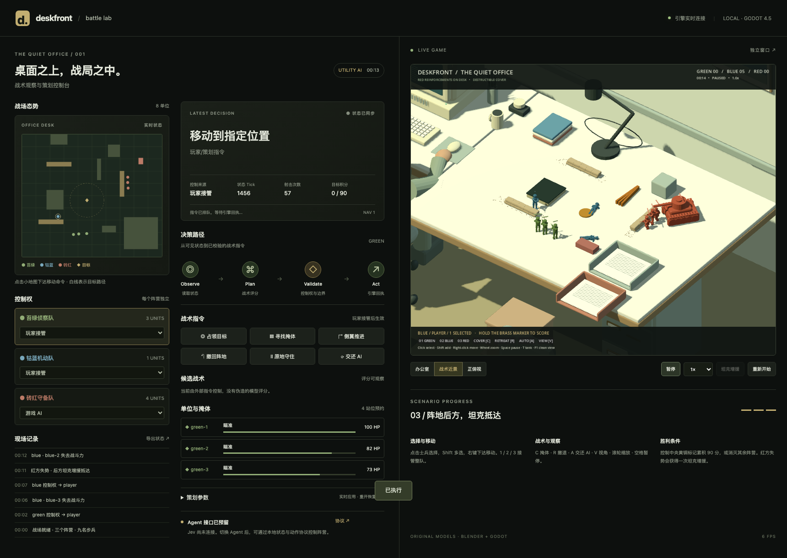
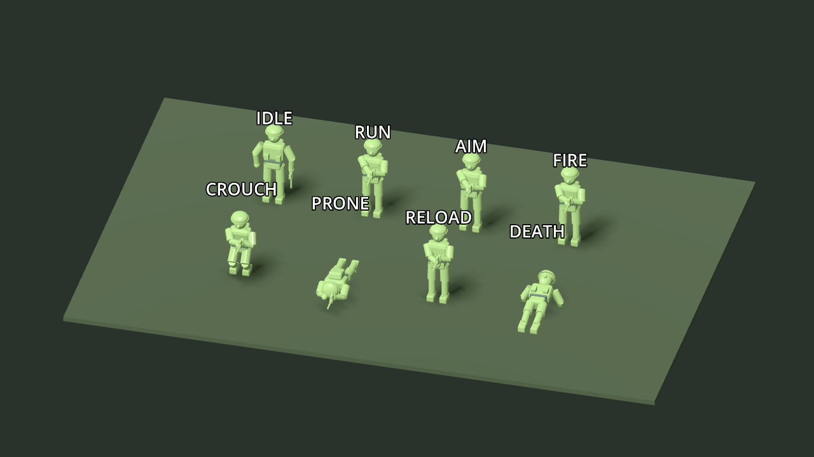

# 桌面前线 · 交付报告

交付日期：2026-09-18。版本：0.1.0。工程：`deskfront-jevlab`。引擎：Godot 4.5.1。建模：Blender 5.2.1 LTS。

## 交付结果

已建立独立、可运行、可编辑的 3D 桌面战术游戏工程，提供 Web 游戏＋本地策划控制台，以及 macOS 原生构建。参考图的复古办公室、操作电脑的人类、桌面三方阵地和后方坦克增援已落实为真实几何场景与玩法。视觉采用原创低多边形模型，不能视为参考图写实画质的逐像素复刻。

| 用户要求 | 实现与证据 |
| --- | --- |
| 新游戏目录、Godot＋Blender | 独立 `project.godot`；七组 `.blend`／GLB；生成脚本可重建 |
| 三阵营可绑骨骼玩具兵 | 绿、蓝、红独立资源；每个17骨骼与有效蒙皮；共用八种战斗动作 |
| 利用掩体和办公道具战斗 | 双向站位、预约互斥、方向减伤、视线、高障碍绕行、压制、弹匣与换弹 |
| 人类缓慢操作电脑 | 独立蒙皮模型、打字循环、手臂和头部细微运动 |
| 玩家接管 | 单兵／多选／整队，移动、指定攻击、掩体、守住、撤退及交还 AI |
| AI 与后续 Agent 接口 | 三阵营效用 AI；本地状态/动作/回执接口；权限与观察新鲜度校验；可运行 Agent 示例 |
| 策划控制页 | 实时 Godot iframe、态势小地图、决策候选、血量、所有权、事件、调参、暂停和重开 |
| 坦克逆转叙事 | 红方失势条件触发一次增援；控制台可演示；射击可破坏掩体并更新导航 |
| 数据驱动与文档 | JSON 配置、运行状态/动作 JSONL；设计、工程、资源、API与研究文档 |
| 开源工程 | MIT 代码与文档、CC0 原创模型；本地 Git 工程；源码压缩包。未擅自发布远程仓库 |

## 如何运行

推荐 macOS 原生试玩以获得流畅帧率：解压 `build/macos/Deskfront.zip` 后运行应用，或者在 Godot 中打开 `project.godot`。这是未签名、未公证的开发构建；已测试本机导出后从终端启动，未测试其他电脑的 Gatekeeper 安装体验。

网页控制台：双击根目录 `启动桌面前线.command`，或执行 `python3 tools/run.py`，访问 `http://127.0.0.1:8768`。Web 包内已经有导出文件，运行不需要 Blender。

原生游戏配策划台时访问 `http://127.0.0.1:8768/?native=1`，避免网页再启动第二个游戏实例。控制服务同端口只维护一个活跃实例。

操作：1/2/3 接管整队；点击选择；Shift 多选；右键移动或指定敌人；C 找掩体；H 守住；R 撤退；A 交还 AI；V 切相机；滚轮缩放；空格暂停；T 坦克演示；F1 隐藏 HUD。

## 验收结果

| 检查层 | 结果 | 证据 |
| --- | --- | --- |
| Godot 导入、主场景冒烟、严格资源许可 | 通过 | `evidence/release-web.json`、`release-macos.json` |
| 引擎玩法语义检查 | **55 项通过** | `evidence/semantic.json` |
| 本地服务与指令队列 | **6 项通过** | `evidence/tests.log` |
| 真实浏览器输入和服务联动 | **13 项通过**，无控制台错误 | `evidence/browser-report.json` |
| GLB 与 Godot 双层模型审计 | 七个模型通过 | `evidence/models-audit.json` |
| 骨骼与动画 | 全部动画目标匹配；有蒙皮；无水平根运动漂移 | `evidence/asset-probe.json`、`animation-audit.json` |
| 动作视觉检查 | 首帧／中段／末段截图检查，并修复持枪与卧倒姿势 | `evidence/animations-*.png` |
| Web 导出 | 通过；真实 WebGL 启动与鼠标键盘操作 | `evidence/dashboard.png`、`top-down.png` |
| macOS 导出 | 通用架构构建通过，本机 Apple Silicon 启动成功 | `evidence/macos-startup.log`、`macos-state.json` |

语义检查覆盖：九名士兵、骨架/动画树、人物打字推进、掩体正面保护与背面失效、独占预约、视线遮挡、玩家真实移动、AI不抢控制权、越界与越权指令拒绝、Agent陈旧状态拒绝、实际射击/伤害、红方增援、一次性坦克、破坏后的寻路重建、暂停和积分胜利。

浏览器检查通过页面真实控件和 iframe 键盘执行：暂停、切视角、切控制权、小地图移动、数字键接管、C掩体、坦克、Agent指令回执、非法Agent动作拒绝、参数调整、重开恢复及响应式布局。不是用模拟数据替代 Godot。

## 画面

## 性能与已知限制

- 本机 Apple M4 Max 原生构建采样约 **119–120 FPS**；这不是低配置设备保证。
- 无头 Chromium 自动化采样约 **7–8 FPS**（先前迭代为7–9），浏览器性能仍有优化空间；不要将功能测试通过等同于 Web 达到60帧。原生版是当前推荐试玩路径。
- 首版是单关卡、每队三名步兵的垂直切片。队形、掩体与战术是可调试的简化实现，不是《英雄连》完整系统；没有大规模路径规划、全身IK、联网对战或物理碎片破坏。
- 模型采用分段刚性蒙皮，塑料玩具风格；人物是低多边形形象，动作细节与场景材质仍可继续提高。
- Jev 的真实协议、账号和凭据未提供，**没有接通真实 Jev 服务**。当前通用 Agent 示例可完成状态→决策→校验→执行闭环；后续只需替换决策适配器。
- Agent 接口为全局完全信息，本地开发服务，无生产级认证。未做多实例路由或互联网部署。记录日志不是完整回放播放器。
- 参数台即时调节不写回默认 JSON；持久改动须编辑配置并重新导出。
- macOS 未签名／未公证；Windows、Linux、移动端未导出与验证。

## 交付物清单

- 工程：`project.godot`、`scenes/`、`scripts/`、`data/`。
- 模型：`source/blender/build_assets.py`、七个 `.blend`、clip manifest、`assets/models/*.glb`。
- 控制台与接口：`dashboard/`、`tools/server.py`、`tools/agent_example.py`。
- 文档：DESIGN、ENGINEERING、ASSETS、AGENT_API、REFERENCES、DELIVERY。
- 许可：根目录 MIT、`assets/LICENSE.md` CC0、`THIRD_PARTY.md`、Godot 版权文本。
- 源码包：`dist/Deskfront-source-0.1.0.zip`。
- Web 可运行包：`dist/Deskfront-playable-web-0.1.0.zip`。
- macOS 可运行包（附许可）：`dist/Deskfront-macos-0.1.0.zip`；原始构建：`build/macos/Deskfront.zip`。
- 文件完整性：`dist/SHA256SUMS.txt` 与 `dist/source-hashes.json`。

所有实际功能以代码、运行证据和导出物为准；后续版本应继续保留这一套可复现的构建与验收流程。
