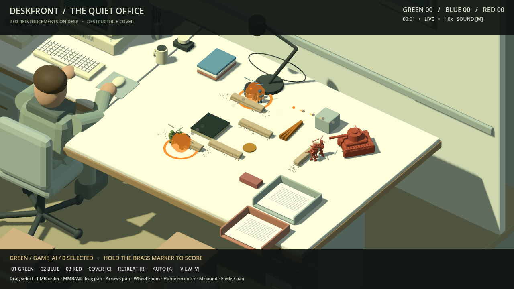
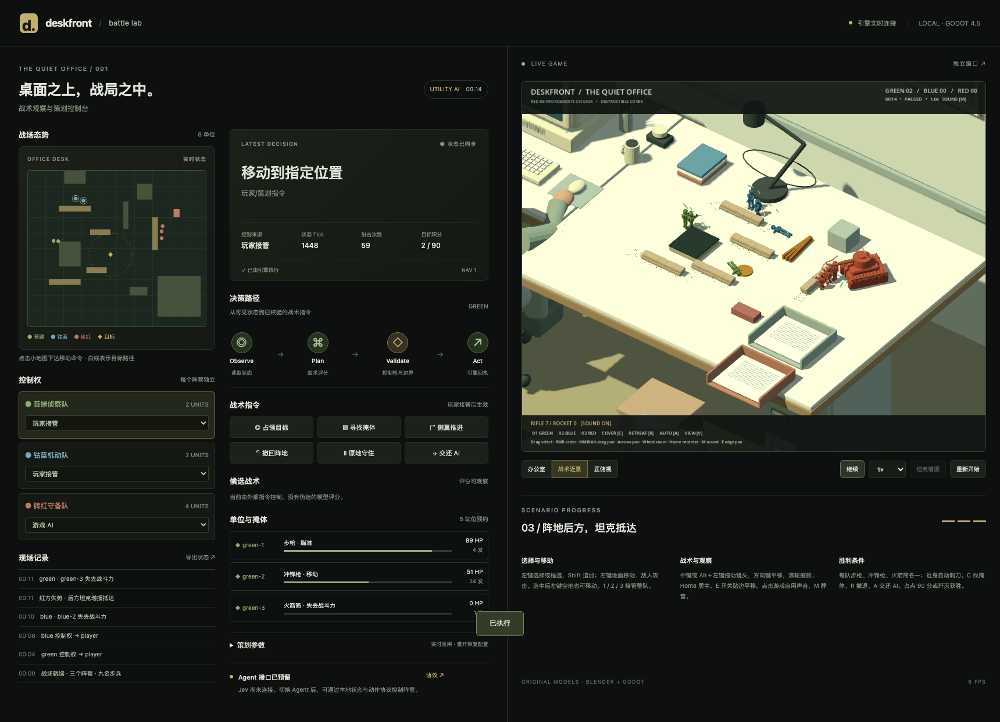

# 桌面前线 0.2.0 · 本轮交付报告

交付日期：2026-09-18。在0.1.0工程上完成战斗反馈、RTS操作和武器迭代。上一版完整报告保留在[DELIVERY-v0.1.0.md](DELIVERY-v0.1.0.md)。

## 已完成

- **弹道与炮火**：步枪/冲锋枪可见弹丸、枪口焰和曳光；火箭/坦克炮有飞行时间、尾烟、爆炸、冲击环和烟尘。伤害在弹丸抵达时结算，火箭有反装甲倍率和范围伤害，爆炸可以破坏沙包并更新导航。
- **声音**：九个原创合成WAV，包括不同枪声、火箭发射、炮声、爆炸、命中、刺刀、指令和换弹。浏览器点击游戏后解锁音频；M静音/开启。不是把声音状态伪装成已播放。
- **RTS镜头与输入**：中键或Alt＋左键拖动镜头、方向键平移、鼠标贴边平移、滚轮缩放、Home居中；左键点选/框选、Shift追加、右键地面移动/敌人攻击。已有选择时左键空地也可移动，指令带地面反馈。
- **掩体优先AI**：开局优先分配可达保护站位，至少稳定6秒；到位交火时不频繁换点，没有射击目标时再向前沿沙包推进。暴露的AI单位会重新找近处保护，玩家/Agent指令不被覆盖。
- **四类步兵战斗行为**：每队1号步枪单发、2号冲锋枪连射、3号火箭筒优先反坦克；所有步兵近身自动刺刀，换弹时也能反击。坦克不受刺刀伤害，小口径武器对装甲效果很低。
- **控制台与配置**：显示兵种、弹药、近战状态；武器数据、AI停留时间与前沿掩体均在JSON中。状态接口向后兼容并提供武器、弹道、镜头和音频状态。

## 立即试玩

刷新原来的 <http://127.0.0.1:8768>，先点击游戏区域启用键盘与声音。按V进入战术近景，按1/2/3接管小队。选择后右键地面移动，按C找掩体；中键拖动镜头。M控制声音，T演示坦克增援。完整操作见[README](../README.md)。

原生版使用 `dist/Deskfront-macos-0.2.0.zip`，运行更流畅。原生版与网页游戏不要同时连同一端口；原生配策划台使用 `?native=1`。macOS仍是未签名、未公证的开发构建。

## 验证与证据

- Godot玩法语义检查：**81项通过**，包括原55项与本轮26项新增。新增检查涵盖三兵种配装、掩体决策、枪械挂骨骼、延迟命中、反装甲差异、范围伤害、射速差异、弹匣换弹、近战、镜头边界与音频节点。
- Python服务协议：**6项通过**。
- 真实浏览器：**21项通过**。覆盖原控制台功能及中键拖动、方向键、缩放、居中、从单选到框选、右键地面反馈、静音切换；WebAudio真实输出端采样检测到非零PCM，无浏览器错误。
- 严格资源检查：**16项通过**（7个原模型＋9个新音频），无未登记资源。音频时长/采样率由工具实际读取，来源、许可与SHA-256可追溯。
- Godot导入、主场景启动、严格发布检查通过；Web与macOS均重新导出。最终包校验和在 `dist/SHA256SUMS.txt`。

证据保留于 `docs/evidence/v02/`。详情见semantic.json、browser-report.json、tests.log、release-web.json、release-macos.json和原生启动状态。

## 实现边界

- 音效为原创程序合成，效果为Godot原生低多边形网格；这版完善可玩反馈，尚非写实战争电影级声画。
- 三种武器几何通过BoneAttachment3D跟随现有Blender骨架。刺刀使用已有骨骼射击姿态叠加短促前刺位移，未新增独立精细刺杀动作。
- 配装按兵号固定，暂无换枪/装备背包。火箭、刺刀属于自动战斗技能；玩家用选兵、移动、攻击和掩体指令控制使用条件。
- 本机Apple M4 Max原生发布包在实际交战、坦克和音效开启时采样约111 FPS。无头浏览器测试约6–7 FPS，功能通过不等于低配置浏览器流畅；优先推荐原生版。实机采样见附带macos-state.json，不作跨设备帧率保证。
- 掩体AI仍是小规模效用规则系统；Jev服务仍未接通。本轮没有改变开源许可或发布远程仓库。

## 交付文件

- `dist/Deskfront-source-0.2.0.zip`：Godot源码、Blender源文件、音效源脚本、测试与文档。
- `dist/Deskfront-playable-web-0.2.0.zip`：本地控制台与Web可运行包。
- `dist/Deskfront-macos-0.2.0.zip`：macOS应用与许可。
- 设计、工程、资源、Agent API与README已同步更新。
