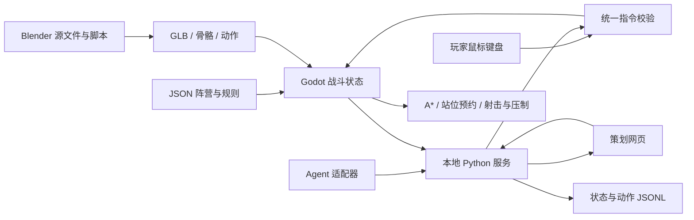

# 工程文档

## 运行结构

Godot 4.5.1 / GDScript 是唯一状态真相源。`scenes/main.tscn` 启动 `scripts/game.gd`，加载 `data/battle.json` 和七个原创 Blender GLB。浏览器运行的也是同一 Godot 工程的 Web 导出，不是网页重写的模拟画面。



### 模块职责

| 文件 | 职责 |
| --- | --- |
| scripts/game.gd | 生命周期、胜负、阵营控制权、效用 AI、输入、相机、HUD、状态快照 |
| scripts/unit.gd | 单兵移动、避让、血量、弹匣、压制、射击、动画状态机 |
| scripts/battlefield.gd | 掩体模型、朝向保护、位置预约、视线判定、动态栅格路径 |
| scripts/bridge.gd | 5Hz 快照同步、命令去重和回执 |
| tools/server.py | 127.0.0.1 控制服务、有限命令队列、过期处理、JSONL记录 |
| dashboard/ | 真实 Godot iframe、小地图、决策检查、控制权和调参 |
| tools/agent_example.py | 无供应商依赖的 Agent 端到端接管示例 |
| tools/project.py | 建模、资源来源登记、导入、测试、Web/macOS导出、打包 |

## 仿真

- 使用 Godot 物理帧，每个 tick 执行移动、冷却、弹匣、压制衰减、AI 决策和目标得分；暂停冻结战斗时间，状态 tick 仍推进以便处理控制消息。
- 固定配置随机种子作用于射击命中；输入到达的 tick 和浮点执行环境也影响结果。不能声称跨平台逐位确定性。
- `game_ai`、`player`、`agent` 三种控制权按阵营互斥。游戏 AI 只对自己拥有的阵营下达指令。
- 目前每阵营只有一个三人小队。小队分配目的地，再为成员生成横向站位偏移。属于基础队形，不是《英雄连》完整层级队形或完整虚拟队长算法。
- AI 每 2.5 秒比较占领、掩护、绕侧、撤退的效用评分。控制台展示的分数来自这段游戏逻辑，不是模型推理概率。
- 0.025 米栅格 A*；高物件阻挡视线；低掩体允许越过射击。坦克使用扩大约 0.075 米的障碍膨胀栅格，避免步兵可走的窄道被误认为坦克可走。
- 步兵近邻避让不会将单位推入阻挡格。被队友占据的中间路径点可跳过，避免产生“避让 → 无法到点 → 永久卡住”的循环。
- 每件掩体两侧各提供三处站位。预约互斥、离开/死亡/破坏释放。保护系数由当前位置、掩体朝向和攻击者方位计算，不能从背面获得正面减伤。
- 坦克一次增援，范围射击会损伤敌人附近可破坏掩体。路障破坏更新寻路 revision，使已有路径重新计算；不是任意物理碎片模拟。

## 动画

三阵营拥有独立 GLB 和 Blender 文件，17骨骼同构，可直接共用语义动作。蒙皮采用分段刚性权重，适合塑料玩具；不是人类皮肤软组织变形。AnimationTree 连接八个状态，切换交叉淡化 0.14 秒。移动位移由游戏控制，动作是原地动画。人物使用独立打字循环，播放速率 0.6 倍。

## 控制服务

Python 标准库服务只监听回环地址；不发出外部网络请求。网页和 Web 游戏同源。服务拒绝不同 Origin 的 POST，限制 JSON 长度、指令类型和队列长度。此接口是本机开发接口，不是已加固的互联网多租户服务。真正部署到局域网/互联网前需增加认证、TLS、访问控制和独立游戏实例路由。

单服务支持一个活跃游戏实例；原生和 Web 同时连接会竞争最新快照，因此同一端口只运行其中一个。需要多个实验时用不同端口；原生通过 `DESKFRONT_URL` 配置对应地址。

## 数据与记录

`data/battle.json` 为默认规则与关卡。策划参数即时生效但不写回 JSON，重开恢复默认；持久调参编辑 JSON 后重新导出。运行期以 `output/session.jsonl` 记录状态、指令和回执，可用于离线分析。当前不提供完整回放播放器、训练任务调度或对战学习算法。

## 测试与导出

```sh
python3 tools/project.py import
python3 tools/project.py test
python3 tools/project.py web
python3 tools/project.py macos
python3 tools/run.py --no-open
# 另一终端，开发依赖安装后
npm install
npx playwright install chromium
npm run test:browser
```

语义测试涵盖骨骼动作、真实移动、掩体方向与预约、控制权、Agent新鲜度、伤害、坦克、破坏、暂停、积分胜利。浏览器测试通过真实按钮、小地图和 iframe 键盘输入验证整个链路；输出截图及 JSON 报告。

外部 Godot Forge 可进一步运行 `forge build` 和 `forge release`，但工程运行不依赖它。测试发生失败时保留日志、截图和报告，不以“导出成功”代替玩法验证。
