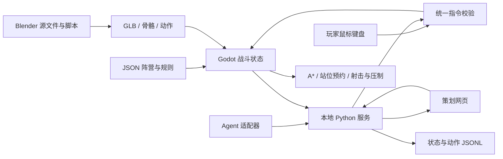

# 工程文档

## 运行结构

Godot 4.5.1 / GDScript 是唯一状态真相源。`scenes/main.tscn` 启动 `scripts/game.gd`，加载 `data/battle.json`、`data/sandbox-maps.json` 及当前资源清单中的 Blender/glTF 资产。浏览器运行的也是同一 Godot 工程的 Web 导出，不是网页重写的模拟画面。



### 模块职责

| 文件 | 职责 |
| --- | --- |
| scripts/game.gd | 生命周期、胜负、阵营控制权、输入、相机、HUD、状态快照 |
| scripts/tactics.gd | 小队阶段协调、虚拟锚点/柔性队形、火力掩护门控、几何绕侧、坦克站位 |
| scripts/unit.gd | 单兵移动、避让、血量、弹匣、压制、射击、动画状态机 |
| scripts/battlefield.gd | 掩体模型、朝向保护、位置预约、视线判定、动态栅格路径 |
| scripts/combat_fx.gd | 飞行弹丸与落点伤害、范围伤害、枪口焰、曳光、烟尘、爆炸、音效与静音 |
| scripts/bridge.gd | 5Hz 快照同步、命令去重和回执 |
| tools/server.py | 127.0.0.1 控制服务、有限命令队列、过期处理、JSONL记录 |
| dashboard/ | 真实 Godot iframe、小地图、决策检查、控制权和调参 |
| tools/agent_example.py | 无供应商依赖的 Agent 端到端接管示例 |
| tools/project.py | 建模、资源来源登记、导入、测试、Web/macOS导出、打包 |

## 仿真

- 使用 Godot 物理帧，每个 tick 执行移动、冷却、弹匣、压制衰减、AI 决策和目标得分；暂停冻结战斗时间，状态 tick 仍推进以便处理控制消息。
- 固定配置随机种子作用于射击命中；输入到达的 tick 和浮点执行环境也影响结果。不能声称跨平台逐位确定性。
- `game_ai`、`player`、`agent` 三种控制权按阵营互斥。游戏 AI 只对自己拥有的阵营下达指令。
- 目前每阵营只有一个三人小队。小队分配目的地，再为成员生成横向站位偏移。属于基础队形，不是《英雄连》完整层级队形或完整虚拟队长算法。
- AI每0.5秒运行小队协调器。实际阶段、推进者和可提供火力的成员ID写入快照；不再用固定数值伪装候选战术概率。
- 0.025 米栅格 A*；高物件阻挡视线；低掩体允许越过射击。坦克使用扩大约 0.075 米的障碍膨胀栅格，避免步兵可走的窄道被误认为坦克可走。
- 步兵近邻避让不会将单位推入阻挡格。被队友占据的中间路径点可跳过，避免产生“避让 → 无法到点 → 永久卡住”的循环。
- 低掩体两侧各三处站位；高障碍四个方向各两处隐蔽/探头站位。预约互斥、离开/死亡/破坏释放。保护系数由当前位置、掩体朝向和攻击者方位计算，不能从背面获得正面减伤。
- 坦克一次增援，范围射击会损伤敌人附近可破坏掩体。路障破坏更新寻路 revision，使已有路径重新计算；不是任意物理碎片模拟。

## 动画

三阵营共用新版 50 骨骼士兵，通过材质区分；`toy_actor.gd` 的手动 AnimationTree 在同一战斗 tick 内采样根运动。Unit 跟随 Actor 位置，禁止叠加旧线性位移。有限侧步完成后才能变向或切换姿态，支撑脚使用双骨 IK；暂停冻结采样和 ragdoll。办公人物为 62 骨骼，独立 office_typing 循环以 0.6 倍播放。

## 控制服务

Python 标准库服务只监听回环地址；不发出外部网络请求。网页和 Web 游戏同源。服务拒绝不同 Origin 的 POST，限制 JSON 长度、指令类型和队列长度。此接口是本机开发接口，不是已加固的互联网多租户服务。真正部署到局域网/互联网前需增加认证、TLS、访问控制和独立游戏实例路由。

单服务支持一个活跃游戏实例；原生和 Web 同时连接会竞争最新快照，因此同一端口只运行其中一个。需要多个实验时用不同端口；原生通过 `DESKFRONT_URL` 配置对应地址。

## 数据与记录

`data/battle.json` 为默认规则与关卡。策划参数即时生效但不写回 JSON，重开恢复默认；持久调参编辑 JSON 后重新导出。运行期以 `output/session.jsonl` 记录状态、指令和回执，可用于离线分析。当前不提供完整回放播放器、训练任务调度或对战学习算法。

## 测试与导出

```sh
python3 tools/project.py import
python3 tools/project.py test
python3 tools/project.py web
python3 tools/project.py macos
python3 tools/run.py --no-open
# 另一终端，开发依赖安装后
npm install
npx playwright install chromium
npm run test:browser
```

语义测试涵盖骨骼动作、真实移动、掩体方向与预约、控制权、Agent新鲜度、伤害、坦克、破坏、暂停、积分胜利。浏览器测试通过真实按钮、小地图和 iframe 键盘输入验证整个链路；输出截图及 JSON 报告。

外部 Godot Forge 可进一步运行 `forge build` 和 `forge release`，但工程运行不依赖它。测试发生失败时保留日志、截图和报告，不以“导出成功”代替玩法验证。

## 0.2.0 战斗反馈与 RTS 输入

`combat_fx.gd` 的 projectile 队列在物理帧推进，命中、压制、装甲倍率和爆炸在抵达时结算。子弹向发射时记录的目标位置飞行，移动可躲避；火箭优先选择射程内坦克。低掩体按朝向减伤，高障碍在发射前进行视线检查。爆炸不伤同阵营单位，周围可破坏掩体仍会受损。

最多100个短暂效果网格、20路音频；视觉随机数与命中随机数分离，画面细节不扰动战斗命中序列。暂停冻结弹道与效果；已播放的短音效自然结束。M立即停止声音并可重新启用。Web使用Godot默认的用户手势解锁机制；真实浏览器测试在AudioDestination前插入Analyser采样，验证非零PCM。

武器现为纯色 GLB，通过 RightHand / LeftHand 世界锚点定位；刺刀仍是近战伤害与短刀光，不宣称独立精细近战骨骼动作。

鼠标点击/框选在左键抬起时解析；中键及Alt左键优先进入镜头拖动模式。拖动跨越HUD也能正常释放。镜头平移限制在办公室区域内，Home复位；选中后的左右键地面指令经过同一权限/边界校验，并显示指令环。右键敌人下达追击，进入武器射程即停步射击。

0.3.0以`scripts/tactics.gd`协调器取代0.2.0的单兵独立效用循环。仅接管`game_ai`阵营；玩家/Agent仍能使用同一单兵掩体动作与队形执行器。详细机制见[TACTICS.md](TACTICS.md)。


## 0.3.0 战术执行与验证

- 小队命令、局部执行分层：协调器每0.5秒分配推进/支援，单兵物理帧执行移动、探头、换弹、射击。接敌取消行军队形，掩护中断停止侧翼动作。
- `AStarGrid2D.update()`不会自动清除未改变尺寸的旧solid标记，因此重建前先`clear()`两张导航网格。破坏测试检查实际格子通行性，不能只检查revision递增。
- 射线采用线段/AABB相交；刺刀同时检查高障碍和存活低掩体，禁止隔沙包刺杀。火炮按车体朝向采用前/侧/后装甲倍率，炮塔独立跟随目标。
- `tests/tactics_checks.gd`：受控掩体、角落探头、换弹回缩、受压制隐蔽、实弹射击、单人侧翼与支援失效、接敌退出队形、导航重建、车体/炮塔和装甲。
- `tests/tactics_soak.gd`：3个固定种子，完整战斗最多90秒，采集掩体占用率、路径查询数、战术阶段和非法导航位置。运行：`godot --headless --path . --script tests/tactics_soak.gd`。
- 每次角色换控或外部战术指令会清理该阵营协调计划。当前一个阵营仅维护一组共享行军锚点，适用于三人小队；不是任意数量独立编队的完整RTS调度器。

正俯视镜头的主要回归原因是位置插值时look_at使用默认世界UP：镜头接近垂直，微小水平跟随误差会改变画面朝向，连续拖动的世界位移互相抵消。顶视模式改用Vector3.FORWARD作为稳定up向量；增加多帧插值拖动测试，修改前稳定失败、修改后通过。此外拖动采用绝对鼠标坐标差，release补齐末段位移，覆盖事件合并情况。浏览器诊断确认鼠标事件完整到达，不能把这次故障归因于丢事件。

## 0.4.0 资源集成边界

地图 renderer 与 battlefield 共享同一 JSON。旋转物件保留旋转碰撞体，网格寻路使用包围旋转轮廓的保守 AABB；毁坏物件同时关闭碰撞和清理导航。河面禁行，桥面可通过并调整单位高度；原预览位于河中的目标移动至南岸。换图重载整局并更换 run_id，旧 Agent 观察无效。

`unit.tick` 决定游戏状态，`presentation_tick` 只执行一次该 tick 的动画采样；步行根运动直接回写 Unit，侧步不受额外分离位移影响。布娃娃在独立 20 倍物理世界中驱动原蒙皮；死亡时复制静态掩体，后续掩体变化不实时更新尸体世界。新 VFX 使用已有弹道的发射/命中事件，未引入第二套伤害逻辑；视觉节点上限 100、音频声部 20。

HTTP 额外开放 `map(index)`、`equip(weapon)` 给本地策划台，`grenade` 给已授权 Agent。地图/装备仍不属于 Agent 管理权限。状态新增 map/map_index、grenades、asset_animation、root_distance、cover_step、contact_slip_max。

冲锋枪暂共用步枪外观，保留独立连射与音效；22 个动作已导入，但翻滚/闪避等没有新增独立玩家技能。站姿前进的原始动画质量与精细换弹手部动作仍有改进空间。


## 0.5.0 战斗执行修正

- Unit 把战术意图、姿态、位移和武器状态分开；生存反应有独立周期与迟滞。ToyActor 按跑/低姿/爬切换相应根运动，并按每个片段实测根速度缩放播放。
- Battlefield 的 ray_box / cover_ray / trace_cover 对真实地图有向盒执行 slab 线段测试；无头快速模拟不依赖 PhysicsServer 每帧变换刷新。单位使用随姿态与朝向改变的身体盒，非逐三角网格碰撞。静态物理阻挡仍由 Godot CollisionShape3D 执行。
- CombatFX 只对实际首个交点结算，手雷弧线分步，大时间步细分，近失弹独立产生压制。爆炸先检查遮挡再破坏，避免同一次爆炸先删除墙再无条件穿墙扣血。
- 地图保存保守 AABB 给导航、有向原尺寸给射线，两者用途分离。选位同时检验原候选与取整后的实际落点；占位还检查空间邻近冲突。跳过短路径节点前验证整个线段，避免避让友军时切掉墙角。
- 毁坏状态、物理层、视觉碎片、预约和寻路 revision 同步；碎块是无阻挡的最终残骸。
- 新验收入口：`godot --headless --path . --script tests/combat_contract.gd`；100 场：`godot --headless --path . --script tests/tactical_rehearsal.gd -- --runs=100 --prefix=final`。重演特定失败可加 `--start=13 --runs=1`。Godot tick/Unit/FX/根运动均实际执行，无替代 Python 战斗模拟。
