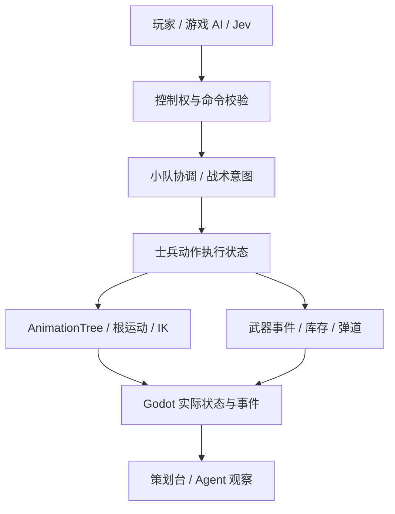

# 资产、动作与 AI 状态机审查

日期：2026-09-19。基线：主工程已发布 0.4.0，提交 `87f718b`；当前浏览器地址 `http://127.0.0.1:8768/`。

本次进行了代码、GLB 元数据、资源配置、原生验收图与现有页面检查，以及开源框架官方资料检索。没有替换资源、安装插件或改动战斗机制；没有重新执行整套发布验收或持续性能基准。

检查期间其他工作正在修改士兵 GLB、步态、战场和动作代码。已发布版为 22 动作；本次资源快照观察到 28 动作，新增 `prone_idle/prone_fire/prone_reload/crouch_reload/bayonet/rifle_fire`。这些属于进行中的工作，不能直接认定已经完成集成、动作衔接与实机验收。以下标明发布基线的问题，供后续修改核对。

原始清单及哈希：`2026-09-19-asset-inventory.json`，33 个资源文件，源文件共约 11.3 MiB。数值不是 GPU 显存或最终下载量。

## 优先结论

1. 优先补足武器动作、动作切换和事件同步；现有士兵面数已足够支撑当前俯视画面。
2. 再整理武器材质分面、烟尘透明层、音效并发和尸体物理成本；先测瓶颈，不依据单次 FPS 判断。
3. 士兵执行状态建议先接入 Godot State Charts；小队协调规则继续复用。决策复杂到需要可视化行为树时再引入 Beehave，或整体评估 LimboAI。
4. 保留纯色塑料、极简办公室、原有灯光与色调；质量提升集中在动作、接触、轮廓、声画同步和层次。

## 全部资产类别

| 类别 | 实查结果 | 建议 | 优先级 |
|---|---|---|---|
| 玩具兵 | 5073 三角形，50 骨，2 个网格分面；三阵营共享模型 | 修肩/肘/膝变形、握把/枪托接触；近景微调轮廓和塑料粗糙度；建立远景动画更新频率与 LOD。暂不以加面为主 | P0 动作，P1 造型 |
| 步枪 | 4353 三角形，7 分面，19 骨；面数约为士兵的 86% | 单色版本合并可合并分面，增加中远景 LOD；保留弹匣/枪机等需要动作的骨骼；统一 Muzzle、左右握点、枪托位置 | P1 |
| 手枪 | 1434 三角形，6 分面，10 骨 | 同样减少单色分面，独立握姿、扳机和后坐；使用武器事件驱动声音与枪口 | P1 |
| 火箭筒 | 2084 三角形，7 网格分面 | 合并静态部分；肩托、前后握点、前端发射与后喷口分开；做正确换弹动作与独立装填状态 | P0/P1 |
| 手雷 | 536 三角形，4 分面 | 合并单色材质；补握持、拉环、释放、投后收手的事件；落地与爆炸分开计时 | P1 |
| 冲锋枪/刺刀 | 0.4.0 冲锋枪共用步枪模型；刺刀逻辑已有，精细动作不足 | 冲锋枪建立独立轮廓、射速反馈；刺刀补装配位置与挥刺命中窗口。工作区已出现 bayonet 片段，继续验证映射与命中同步 | P0 动作，P1 外形 |
| T2 坦克 | 7222 三角形，10 分面，4 履带片段；3 个 skin 各列 45 joints，并不表示 135 个不同骨骼 | 保留 T2；优先履带随真实速度/倒车变化、左右转向差速、炮管回座、炮口与开炮事件，再补近景轮廓细节 | P1 |
| 办公人物 | 5776 三角形，62 骨，10 分面；1 个打字循环 | 保留造型；手腕/手指对齐键盘鼠标，坐骨/脚接触校验；增加低频微动作和远景更新降频，避免整个人重复摇摆 | P2 |
| 办公室/电脑/桌面道具 | 当前办公室 28164 三角形、14 分面；整体按材质合并 | 保留极简风格。只对可破坏物分出完整/受损/碎片状态、碰撞与导航更新；其余静态部分保留合批。CRT 可加细微显示变化 | P2 |
| 沙包/地图物件 | 单沙包 540 三角形、2 分面，场景大量重复实例 | 静态沙包批量实例化或按墙段合并；破坏时切换受损/散落版本。保留站位 ID、端点、法线和高度，避免画面与战术代理分离 | P1 |
| 爆炸/烟雾 | 图集+流场混合、深度软交界；shader 为 unshaded 透明片 | 先做光照响应、随机朝向/相位、尾烟连续性和遮挡可读性；再评估更重的体积方案。桌面战场不宜让烟雾长期遮住整队 | P1 |
| 音效 | 按武器分事件；20 声部上限，单事件单样本加随机音高；仍混有旧资源 | 每类枪加入少量轮换样本、机械层和尾音；爆炸/UI/枪声独立总线和优先级；校准监听点与桌面尺度衰减；保留 CC-BY-SA 来源 | P1 |
| 字体/UI/资源包 | 字体可复用；assets 同时保留 3 个旧兵、旧 worker、旧 office，导出 all_resources | 旧资源移至可追溯归档或显式排除非运行文件；字体按实际字符与语言需求检查；UI显示引擎版本、资源哈希与运行实例 | P2 |

材质覆盖为同一种颜色不会自动把所有网格分面变成一个分面。上表分面数来自源 GLB，步枪的 7 surfaces 也有已有 Godot 导入审计证据。实际 Draw Calls 仍需运行时 profiler 测量。

## 动作与执行层的问题

### P0：把“拥有片段”变成“正确执行战斗动作”

0.4.0 `scripts/unit.gd:119` 的动作映射中：

- 步枪/冲锋枪 `fire` 映射到 `rifle_idle`，缺少真正的后坐、枪托受力与恢复。
- `prone` 映射到 `cover_idle`，被压制的视觉语义不完整。
- 通用 `reload` 来自 `Pistol_Reload`，并不等于步枪/火箭筒装填。
- 探身统一选择 `cover_peek_left`，需要依据掩体端点决定左右侧。
- 已导入转身、翻滚和闪避，不能据此声称游戏已有对应动作能力。

工作区新增的六个动作正覆盖其中部分缺口。应继续检查：武器与姿态映射、上半身遮罩、动作能否完成、何时允许打断，以及实际子弹/弹匣/音效是否对齐。

### P0：脚接触与转向仍需扩大验收

`toy_actor.gd::apply_foot_contacts()` 目前主要对 cover 系列生效，进入/退出蹲姿被排除。先前的横向蹲行验收不能推广为前进、跑步、倒退、转身、爬行及台阶都不滑。

0.4.0 普通路线转向直接改变朝向，运动根位移还会被导向寻路目标。这是需要重点测量的接触风险，不是本次已经测得的新滑步数值。建议补起停、90/180 度转身、8 方向移动、不同速度、短目标点、动态阻挡及地形高度变化的固定种子录像与接触测试。

### P0：动画事件取代散落的计时常量

手雷目前以 `.62` 秒生成弹体、`1.267` 秒结束动作；换弹由 weapon reload 数值计时，动作资源有自己的长度。修改速率、过渡时间或片段后容易声画错位。

建议统一事件：`foot_down`、`muzzle_fire`、`mag_out`、`mag_in`、`reload_complete`、`grenade_release`、`action_finished`。游戏继续负责伤害和库存，事件提交到同一执行器并保证幂等；不能由表现层重复扣弹或造成第二次伤害。

### P1：命中与物理反馈

`unit.gd::hit()` 的死亡调用使用固定偏移原点和固定力度，未携带真实弹丸/爆炸方向。所有死亡使用相似力度会削弱武器区别。布娃娃目前用 PinJoint3D，缺少人体关节角度限制；每具尸体独立创建物理世界并复制静态碰撞。

建议传入命中位置/方向/冲量，区分普通倒地与爆炸击飞；增加关节限制、入场混合、睡眠和尸体数量预算；动态掩体破坏后更新碰撞。不要让每一发步枪都表现成爆炸击飞。

### P1：特效与音频预算

已有 100 个视觉节点、20 个声部上限，不能再把“没有预算”列为问题。实际缺口是按重要性淘汰/降级与资源复用：当前到上限直接跳过新效果/新声音，并频繁 new/free 节点、网格和材质。

应优先保证近景枪口、玩家武器和关键爆炸可见可听，远处残烟先退场；用对象池和共享资源降低抖动。烟雾为无光照片，需在不改变环境灯光的前提下加入受光层次。尾烟按飞行距离连续发射，减少当前可见的离散烟点。

坦克演示使用 Forward 履带片段，移动时固定速率；倒车与转弯需要根据真实车辆速度和转向选片段或参数，不能只看 `state == move`。

## 当前 AI 的真实结构

- `tactics.gd`：小队协调器，约每 0.5 秒决策，阶段为 take_cover / suppress / bound / advance / retreat；已有预约、掩护者检查、轮换推进、侧翼、撤退和坦克支援。
- `unit.gd`：单兵移动、压制、射击、装填、投雷、掩体探出/回缩，用字符串、布尔值和计时器组织。
- `toy_actor.gd`：AnimationTree、根运动、脚接触与布娃娃。22 片段时两两连通为 462 条转移；28 片段则为 756 条。重点问题是转移约束与维护复杂度，尚未测出它是 CPU 瓶颈。
- `battlefield.gd`：寻路、遮挡、站位评分、预约与破坏。这些领域能力值得保留。
- `bridge.gd` / Agent API：已有控制权、run_id、seen_tick 和回执；Jev 未验证专有接入。

当前可以描述为“手写的分层战术/执行逻辑”，还不是通过可编辑状态资源组织的通用 HSM。网页上的 UTILITY AI / 战术评分文案也应与实际小队阶段逻辑一致。

## 现成框架选型

| 方案 | 可复用能力 | 对本项目的建议 |
|---|---|---|
| [Godot State Charts](https://github.com/derkork/godot-statecharts) | MIT；分层、并行/历史状态、事件、条件守卫、延时转移与运行调试 | **近期首选**，用 GDScript 接入士兵执行层，明确走、蹲、探身、换弹、投雷和死亡的转移规则 |
| [Beehave](https://github.com/bitbrain/beehave) | MIT；场景节点式行为树、运行调试与性能监视 | 后续把小队“选掩体→找支援→跃进→侧翼”做成可视化决策树时使用；它不是骨骼动画状态机 |
| [LimboAI](https://github.com/limbonaut/limboai) | MIT；行为树、分层状态机、黑板和调试整合 | 适合希望统一 AI 工具链的路线；C++ module/GDExtension 接入与 Web 导出需要专项验证 |
| [Godot AnimationTree](https://docs.godotengine.org/en/4.5/tutorials/animation/animation_tree.html) | 动画状态、混合树、根运动 | 保留，负责最终姿态；与游戏执行状态分工，不用动画图代替小队战术决策 |

推荐顺序：先 State Charts + 原有协调器 + AnimationTree。不要第一轮同时接入三个 AI 框架。

截至本次查询，State Charts release 为 v0.22.5；LimboAI 最新 v1.8.1 的下载包标有 GDExtension 4.6 / module Godot 4.7.2，不应直接拿最新包安装到当前 4.5.1。LimboAI 历史 1.5.x release 有 4.5 支持和无线程 Web 构建记录，兼容包需要单独锁定并测试。当前 Web preset 的 `extensions_support=false`，引入其 GDExtension 需要修改发布配置。

Beehave README 的兼容表与 latest release 说明存在版本口径差异：README 提到 Godot 4.5+ / 2.10+，本次 API 的 latest 为 v2.9.3 且说明面向 Godot 4.7。选择时应锁定实际源码 commit 并跑 4.5.1 的导入与 Web 用例，不能只凭名称或 latest 判定兼容。

State Charts 官方文档已经将专用 Animation Tree/Player State 节点标为 deprecated；新接入通过普通状态信号调用自己的动画适配层，避免依赖这些节点。

这些框架提供控制结构和调试工具，项目特有的掩体预约、步态接触、枪口事件、队形与装甲战术仍需保留或编写。

## 建议分层

士兵“存活”下可并行维护移动与武器状态，但必须有相互约束：例如短步完成后才变向、投雷释放窗口禁止换武器、死亡可以抢占一切。死亡/布娃娃/稳定尸体是高优先级分支；状态退出时释放站位、取消过期动作并清理队列。

Jev 只提交目标或技能意图，不能每帧直接选骨骼片段。补充 `command_id`、执行状态、动作锁定/可打断点、失败原因、可行动作列表，方便异步模型知道命令是排队、执行中还是完成。黑板保留威胁、目标、掩体预约、支援成员、弹药、压制与最后一次观测；字段语义在游戏内统一。

## 推荐实施与验收

1. **P0 动作接入**：审完工作区新片段，补持枪和分姿态动作映射、左右探身、动画事件、常见步态接触；同镜头对比。
2. **P0 状态边界**：一个士兵先迁移 State Charts，保留原有伤害/寻路；测试移动中换弹、探身受压制、投雷中死亡、掩体被毁、玩家/Agent接管。
3. **P1 资源与表现**：武器分面/LOD、炮口/握点、履带/后坐、烟尘光照/连续性、声音层次、布娃娃。
4. **P1 性能基准**：三张地图，九兵+坦克，密集交火与多次爆炸；记录主线程、渲染、绘制批次、透明重叠、物理成本及峰值内存。目标可定 Web 30 FPS / 桌面 60 FPS，以指定机器的持续采样验收。
5. **P2 场景与打包**：办公人物微动作、模块化破坏、历史资产排除、版本标识。

既有报告中的原生 114 FPS、无头浏览器约 3–6 FPS，以及本次接口终局 120 FPS 都来自不同条件，不宜横向比较或证明游戏已完成性能优化。

## 当前页面一致性观察

本次读取的浏览器截图仍显示紧凑旧办公室布局，页面无新版地图/装备控件；同时本地 API 返回 version=0.4.0、crossroads 与 50 骨士兵。尚未定位到缓存、页面更新时间或多个实例的具体原因，不能把该截图当作新版资产的最终画面。

建议页面、嵌入游戏和服务端快照显示相同的 build_id / asset_hash / engine_instance_id。`server.py::sync()` 当前接受合规快照后直接覆盖最近状态，多引擎并存时需要绑定活动实例。这是审查可靠性和后续 Agent 调试的基础。

## 官方资料

- State Charts：[项目与许可](https://github.com/derkork/godot-statecharts)、[状态节点/并行/历史/弃用说明](https://derkork.github.io/godot-statecharts/usage/nodes)、[发布](https://github.com/derkork/godot-statecharts/releases)。
- Beehave：[项目、兼容表与调试](https://github.com/bitbrain/beehave)、[v2.9.3](https://github.com/bitbrain/beehave/releases/tag/v2.9.3)。
- LimboAI：[获取方式与导出要求](https://limboai.readthedocs.io/en/stable/getting-started/getting-limboai.html)、[版本/平台发布](https://github.com/limbonaut/limboai/releases)。
- Godot 4.5：[AnimationTree](https://docs.godotengine.org/en/4.5/tutorials/animation/animation_tree.html)。
